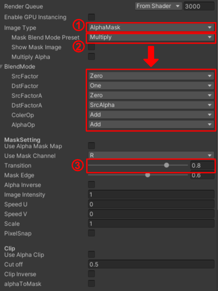
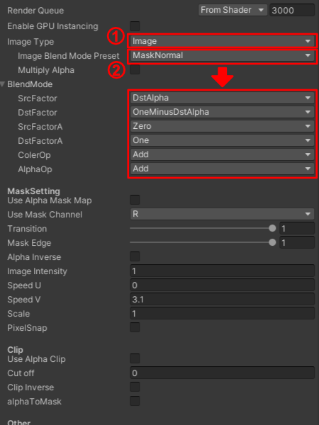
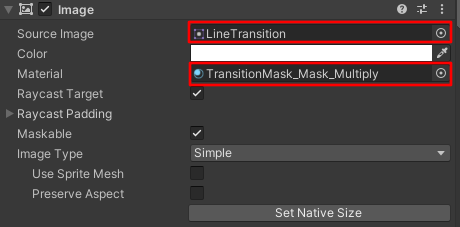
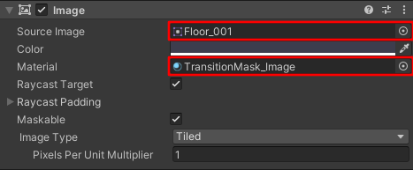

# TransitionMask
TransitionMaskはUnityのDstAlphaを使って半透明にするShaderです。
このShaderは[Unity #2 Advent Calendar 2020 15日目](https://qiita.com/A_rosuko/private/1bda25f9597a08891747)の記事で紹介しています。

# DEMO

# Installation
Unityプロジェクト内に下記のフォルダをプロジェクト内にコピーしてください。
* Assset/Shaders/TransitionMask
Shader本体です。
* Assset/ExampleScenes
サンプルシーンです。

# Usage
このshaderはuGUIのImageにMask用とImage用で2つ以上のMaterialを使用します。
ここでは最小構成での使い方を説明します。
1. TransitionMaskのMaterialを2つ作成してそれぞれの名前を**TransitionMask_Mask_Multiply**と**TransitionMask_Image**に変更します。

1. **TransitionMask_Mask_Multiply**はImageTypeで**AlphaMask**にしてMaskBlendModePresetで**Multiply**を選択します。
BlendModeが`Zero One,Zero SrcAlpha Add Add`になります。
Transirionは最後に透明度の制御に使います。

1. **TransitionMask_Image**はImageTypeで**Image**にしてImageBlendModePresetで**MakeNormal**を選択します。
BlendModeが`blend DstAlpha OneMinusDstAlpha Zero One Add Add`になります。

1. GameSceneでuGUIのImageを2つ作成してそれぞれのオブジェクトの名前を**Image_Mask**と**Image_Color**に変更します。

1. **Image_Mask**のImageコンポーネントに**AlphaMask用の画像**と**TransitionMask_Mask_Multiply**をアタッチします。

1. **Image_Color**のImageコンポーネントに**表示用画像**と**TransitionMask_Image**をアタッチします。

1. AlphaMask、Imageの描画順になるようにして、さらにオブジェクトが重なるように配置します。

1. **Image_Mask**の**TransitionMask_Mask_Multiply**マテリアルの**Transition**の値を変更すると**Image_Color**の表示が半透明になるのが確認できます。

# Author
Twitter:@A_rosuko
 
# License
MIT
